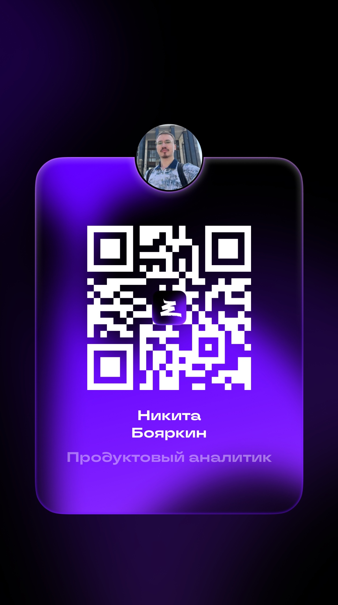

<h3 align="center" > Hi Everyone!</h3>

- I am data analyst/ product analyst
  
- All my projects are available at [portfolio](https://nikitaboyarkin.github.io/Personal_Projects.github.io/)

- My [notes](https://nikitaboyarkin.github.io/digital_garden/) about **emotional** *intelligence* in IT

<h3 align="left">Languages and Tools:</h3>

            

<h3 align="left"> Connect with me </h3>

  
  

